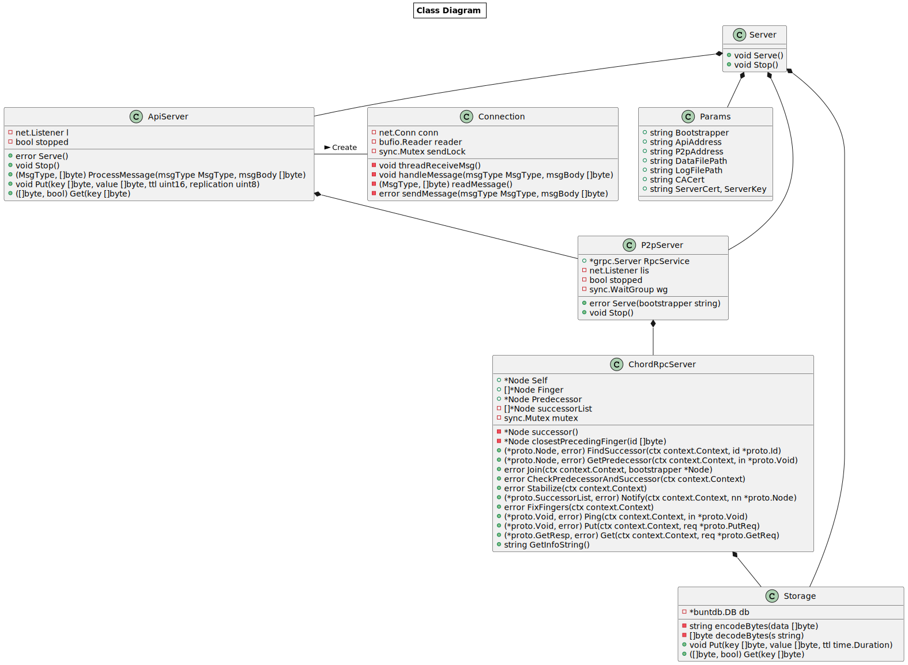
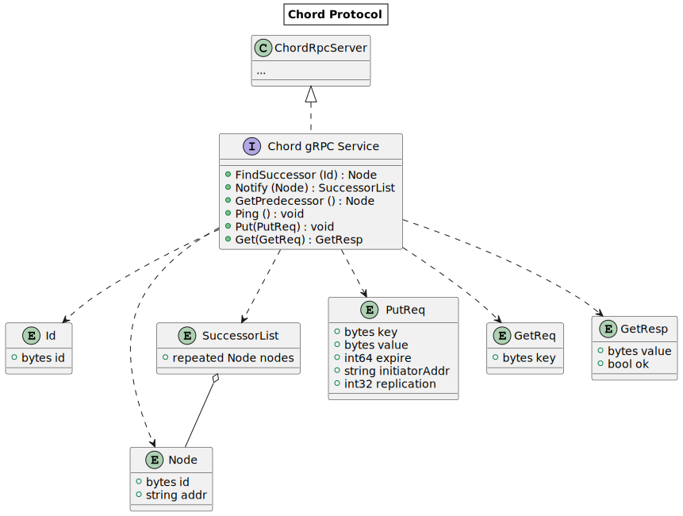

# DHT Store

This is an implementation of a P2P data storage module based on [Chord protocol](https://pdos.csail.mit.edu/papers/chord:sigcomm01/chord_sigcomm.pdf) in Golang.

## 1 Documentation

### 1.1 Building

1. Install Go 1.18 or newer version.

```bash
# download the latest version of Go
wget https://go.dev/dl/go1.19.linux-amd64.tar.gz
# install
sudo tar -C /usr/local -xzf go1.19.linux-amd64.tar.gz
# add /usr/local/go/bin to the PATH environment variable
export PATH=$PATH:/usr/local/go/bin
# verify the installation is successful
go version
```

2. Run the build script in the directory of the project.

```bash
bash ./scripts/build.sh
# now, executable files *dht* and *client* are generated in the directory *output*
ls output/
```


### 1.2 Generating Certificates

1. For CA, generate the key and certificate of CA.

```bash
# run generate_ca.sh script, and specify the output directory for the ca certificate.
bash ./scripts/generate_ca.sh ./config/ca-cert
```

2. Generate the key and certificate for a node.

```bash
# run generate_cert.sh script, and specify the directory of the ca certificate, the directory for output, and the IP of the node.
bash ./scripts/generate_cert.sh ./config/ca-cert ./config/node1 127.0.0.1
```


### 1.3 Composing the Configuration File

Compose the configuration file shown below in INI format for each node.

```ini
[dht]
;bootstrapper node used for join an existing Chord network, *leave blank* if it is the first node
bootstrapper = 127.0.0.1:7402
;address used for P2P protocol
p2p_address = 127.0.0.1:7412
;address used for API protocol
api_address = 127.0.0.1:7411
;log filename
log_file = node1.log
;data filename
data_file = data1.db
;the public certificate of CA
ca_cert = ./config/ca-cert/ca-cert.pem
;the private key of the node 
hostkey = ./config/node1/hostkey.pem
;the CA-signed certificate of the node
hostcert = ./config/node1/host.pem
```


### 1.4 Running

* Run DHT

```bash
# run the dht, and specify the configuration file
./output/dht -c config/node1/config1.ini
```

* Run a test client

```bash
# run the test client, and specify the api address of any node
./output/client -addr 127.0.0.1:7411
# This client supports get and put command:
# - get <key:str>: get the value for the given key.
# - put <key:str> <value:str> <ttl:int> <replication:int>: put the key value pair.
```


## 2 Architecture

### 1.1 Overview

The class diagram of the module is shown as bellow.



* *Server* defines a DHT server, consisting of *Params*, *ApiServer*, *P2pServer* and *Storage*.
* *Params* defines the parameters for a server, in which the parameters are loaded from a configuration file.
* *ApiServer* defines a server handling API requests of clients by creating *Connection*s.
* *Connection* defines a connection to a client handling incoming API requests.
* *P2pServer* defines a P2P server handling requests from other P2P servers.
* *ChordRpcServer* defines a Chord server running the Chord algorithm.
* *Storage* defines a persistent K/V storage.

Basically, *ApiServer* listens on a given API address and accepts any incoming TCP connections. Once a new TCP connection established, *ApiServer* will create a separate *Connection* object for this TCP connection and start a goroutine running *threadReceiveMsg()* function of this *Connection* object, handling incoming API requests on this connection, so that the *ApiServer* can serve multiple clients at the same time.

Non-blocking communication is used in the module. In the implementation, separate goroutines are used when communicating with multiple clients. In Go, the file descriptors - such as sockets - are managed by the goroutine scheduler. If a goroutine is blocked and waiting for some events such as arrival TCP packets, Go runtime will not wake the goroutine up unless there are corresponding events arrived for it to be processed. Thus, this mechanism is similar to *epoll* in Linux or *AsyncIO* in Python.


### 1.2 The Peer-to-Peer Protocol in the Implementation

#### 1.2.1 Introduction

Chord is used as the P2P protocol. Then, the protocol is built on top of *gRPC*, which is a modern, open source remote procedure call (RPC) framework. *gRPC* enables client and server applications to communicate transparently.


#### 1.2.2 Protocol Overview

*gRPC* serializes structured data using *Protobuf* and sends the serialized messages over HTTP/2 channels. the Chord gRPC service is defined as follows.




#### 1.2.3  Protocol Detail

Chord nodes provide 6 interfaces - *FindSuccessor*, *Notify*, *GetPredecessor*, *Ping*, *Put* and *Get* - to communicate with each other.

* *FindSuccessor* asks our node to find the given id's successor. The successor as a *Node* object is returned.

| *FindSuccessor*() |  Type  | Name | Description                         |
|:-----------------:|:------:|:----:|:------------------------------------|
|     Request:      | bytes  |  id  | The id for finding whose successor. |
|     Response:     | bytes  |  id  | The id of the successor.            |
|                   | string | addr | The RPC address of the successor.   |


* *Notify* lets our node think the given node might be our predecessor, The successor list of our node as a *SuccessorList* used on nodes leaving is returned.

| *Notify*() |  Type  | Name  | Description                      |
|:----------:|:------:|:-----:|:---------------------------------|
|  Request:  |  Node  | node  | The node may be our predecessor. |
| Response:  | []Node | nodes | Our successor-list.              |

* *GetPredecessor* asks our node to return our predecessor as a *Node* object.

| *GetPredecessor*() | Type | Name | Description       |
| :----------------: | :--: | :--: | :---------------- |
|      Request:      | void |      |                   |
|     Response:      | Node | node | Our predecessor. |

* *Ping* asks our node to respond with an empty message, used to keep alive.

| *Ping*()  | Type | Name | Description |
| :-------: | :--: | :--: | :------------------------------------ |
| Request:  | void |      |                                       |
| Response: | void |      |                                       |


* *Put* asks our node to put the key/value pair in the *PutReq* to our storage, then forwards the request to our successor if needed.

|  *Put*()  |  Type  |     Name      | Description                                                                                                              |
|:---------:|:------:|:-------------:|:-------------------------------------------------------------------------------------------------------------------------|
| Request:  | bytes  |      key      | The key of the data item.                                                                                                |
|           | bytes  |     value     | The value of the data item.                                                                                              |
|           | int64  |    expire     | The data item expires at this time, in the format of UNIX timestamp.                                                     |
|           | string | initiatorAddr | The address of the node initiating the Put request.                                                                      |
|           | int32  |  replication  | The times the data item should be replicated. This value needs to be decremented by one when forwarding to another node. |
| Response: |  void  |               |                                                                                                                          |


* *Get* asks our node to get the value for the given key specified in the *GetReq* from our storage, and return the result as a *GetResp*.

|  *Get*()  | Type  | Name  | Description                   |
|:---------:|:-----:|:-----:|:------------------------------|
| Request:  | bytes |  key  | The key to look up.           |
| Response: | bytes | value | The value of the key, if any. |
|           | bool  |  ok   | Whether the key exists.       |


### 1.3 Security measures

#### 1.3.1 Identity Assignment

The implementation provides defense against ID Mapping Attack. Specifically, the identity of  each node must equal the hash of its IP address and port. This requirement is checked in the *Notify* and *Stabilize* interfaces. If the node passed in the interface is not satisfied, it is not allowed to become a predecessor, successor, or other entry in the finger table. Therefore, this approach makes it hard for an attacker to assume a random identity.


#### 1.3.2 Authentication and Encryption

The mutual SSL/TLS authentication and encryption during P2P communication are implemented so far.

In detail, a CA(Certificate Authority) is introduced in the protocol. For each node who wants to join the Chord network needs to ask the CA to sign its own certificate. Then, Once a node A wants to establish a *gRPC* connection to another node B and invoke some its functions, they need to verify each other's certificates during the handshake phase. To be more specific, node A needs to present its certificate to node B, and node B also needs to present its certificate to node A. If either finds the other's certificate to be invalid or not signed by the CA, the handshake fails and the connection will never be established. Otherwise, the *gRPC* connection will be established successfully, all data transferred between A and B are encrypted by AES.


## 3 Quality Guarantee

* Used go-fmt to format all codes to make them easy to read and maintain.
* Wrote comments for each struct and each function.
* Code test coverage reaches 80%, see `assets/TestCoverageReport.html` for the coverage report.


## 4 Future Work

* Currently, data storage is not encrypted, which may lead to data leakage. Asymmetric encryption can be used to encrypt data with the user's public key, and decrypt it with the private key when the user queries.
* Due to the introduction of CA, the system has the single point of failure. The chain of trust method can be used, so that entities can rely on another entity’s trust.
